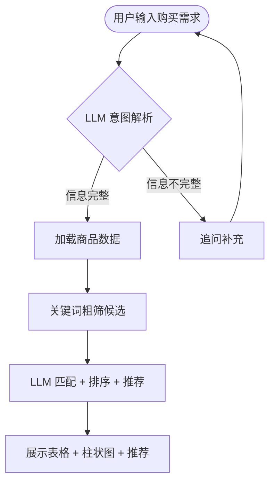

import { Card, CardGrid } from '@astrojs/starlight/components';

**Price Compare Agent (PCA)** 是一个桌面应用程序，用户用自然语言描述想买的商品，AI 自动跨平台比价并给出推荐。

你可以在 [GitHub Release](https://github.com/Badnuker/price-compare-agent/releases) 下载最新版本。

<CardGrid>
  <Card title="🔍 自然语言比价" icon="add">
    输入"300 以内运动蓝牙耳机"，自动解析意图、跨平台匹配、排序推荐
  </Card>
  <Card title="📊 价格可视化" icon="add">
    比价表格 + 柱状图，不同平台一目了然
  </Card>
  <Card title="🤖 双模型兼容" icon="add">
    支持 OpenAI 兼容格式和 Anthropic Claude，设置页一键切换
  </Card>
  <Card title="⚡ 实时反馈" icon="add">
    搜索时实时展示"理解需求→筛选→分析→推荐"四步进度
  </Card>
</CardGrid>

## 核心流程

## 快速体验

1. 从 [Release 页面](https://github.com/Badnuker/price-compare-agent/releases) 下载安装包
2. 首次打开会自动弹出设置页，填入你的 API Key
3. 在搜索框输入想买的商品（如"找一款 300 以内适合运动的蓝牙耳机"）
4. 查看比价结果和推荐
