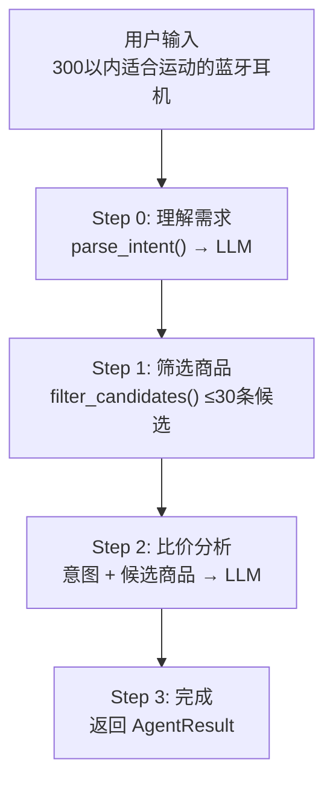

## 概述

Agent 是项目的核心，负责编排从用户输入到比价结果的完整流水线。代码只做流程控制和数据传递，所有智能决策由 LLM 完成。

## 流水线



## 设计原则

### 最少 LLM 调用

全程只调用两次 LLM：意图解析一次，匹配推荐一次。中间的商品筛选用本地关键词匹配——把商品名称、分类、规格、功能标签拼成文本，统计关键词命中数，按分数排序取前 30 条。

### 低 Temperature

- 意图解析：`temperature = 0.1`（需要稳定、可解析的 JSON）
- 比价分析：`temperature = 0.3`（需要一定的灵活性做匹配和推荐）

### JSON 输出约束

每次 Prompt 都强调"只输出 JSON，不输出任何其他内容"，返回后清洗可能的 markdown 包裹（`` ```json ... ``` ``）。

## 意图解析

**输入**：用户的自然语言文本

**Prompt 模板**：
```
你是一个电商比价助手。分析用户的购买需求，提取关键信息。

规则：
- 只要有商品类型，就可以进行比价，is_complete 应为 true
- brand、model、budget 都是可选的辅助信息

{输出 JSON 格式}

用户输入：{input}
```

**输出示例**：
```json
{
  "product_name": "蓝牙耳机",
  "brand": null,
  "budget_max": 300,
  "features": ["运动", "健身"],
  "is_complete": true,
  "missing_fields": []
}
```

只有 `product_name` 无法识别时才标记 `is_complete: false`。品牌、型号、预算缺失不算不完整。

## 商品粗筛

纯本地计算，不调 LLM：

1. 提取意图中的关键词（product_name + brand + features）
2. 对每条商品：拼接 name + category + specs + features 为文本
3. 统计命中关键词数 = 匹配分数
4. 按分数降序排列，取前 30 条

控制候选数量是为了节约 LLM token 消耗。商品数据用 `include_str!` 编译时嵌入，零运行时 I/O。

## LLM 匹配与推荐

将所有候选商品序列化为 JSON，连同用户意图一起喂给 LLM：

**Prompt 模板**：
```
你是一个电商比价助手。根据用户需求和候选商品列表，完成：
1. 匹配跨平台相同商品 → match_type
2. 按价格排序
3. 给出推荐理由

返回 JSON：{products: [...], recommendation: "..."}
```

**LLM 的判断能力**：
- 京东"Redmi Buds 5" vs 淘宝"红米Buds5" → 同一商品
- 综合价格、运费、评分 → 推荐理由
- 规格不同的标注"替代推荐"而非"完全匹配"

> **源码**：[`src-tauri/src/agent/orchestrator.rs:63-131`](https://github.com/Badnuker/price-compare-agent/blob/main/src-tauri/src/agent/orchestrator.rs#L63-L131)

## Tauri 事件总线（可观测性）

Agent 执行过程中，通过 Tauri 事件总线向前端实时推送进度，前端展示 Steps 进度条。

### 事件一览

| 事件名 | 负载类型 | 说明 |
|--------|---------|------|
| `agent-step` | `{ index: number, label: string }` | 流水线步进，index 0-3，前端进度条跟随变化 |
| `agent-step-error` | `string` | 错误或追问消息，前端展示 Alert |

### 事件触发时机

```
invoke("search_products")
  ↓
emit("agent-step", { index: 0, label: "理解需求" })   ← 开始 LLM 意图解析
  ↓
emit("agent-step", { index: 1, label: "筛选商品" })   ← 开始本地粗筛
  ↓
emit("agent-step", { index: 2, label: "比价分析" })   ← 开始 LLM 匹配推荐
  ↓
emit("agent-step", { index: 3, label: "完成" })       ← 返回结果
```

**错误分支**：

```
parse_intent() 返回 is_complete = false
  → emit("agent-step-error", "请补充...")
  → 返回 Error，流水线终止

filter_candidates() 返回空 Vec
  → emit("agent-step-error", "未找到匹配商品...")
  → 返回 Error
```

> **源码**：[`src-tauri/src/agent/orchestrator.rs:29-58`](https://github.com/Badnuker/price-compare-agent/blob/main/src-tauri/src/agent/orchestrator.rs#L29-L58)

## 关键函数参考

### `AgentOrchestrator::run()`

流水线主入口。协调四步转换，处理 LLM 返回的字符串到 `AgentResult` 结构体的解析。

> **源码**：[`src-tauri/src/agent/orchestrator.rs:39-140`](https://github.com/Badnuker/price-compare-agent/blob/main/src-tauri/src/agent/orchestrator.rs#L39-L140)

### `parse_intent()`

发送用户输入到 LLM，附带严格的 JSON schema 系统提示。提取商品名、品牌、预算、功能需求。

> **源码**：[`src-tauri/src/agent/intent.rs:7-62`](https://github.com/Badnuker/price-compare-agent/blob/main/src-tauri/src/agent/intent.rs#L7-L62)

### `filter_candidates()`

从 `ParsedIntent` 提取关键词（name、brand、features），对商品执行子串匹配。按命中数排序后截取前 30 条。

> **源码**：[`src-tauri/src/agent/tools.rs:11-48`](https://github.com/Badnuker/price-compare-agent/blob/main/src-tauri/src/agent/tools.rs#L11-L48)

### `load_products()`

用 `include_str!` 在编译时将 `data/products.json` 嵌入二进制，运行时零开销加载。

> **源码**：[`src-tauri/src/agent/tools.rs:4-8`](https://github.com/Badnuker/price-compare-agent/blob/main/src-tauri/src/agent/tools.rs#L4-L8)
