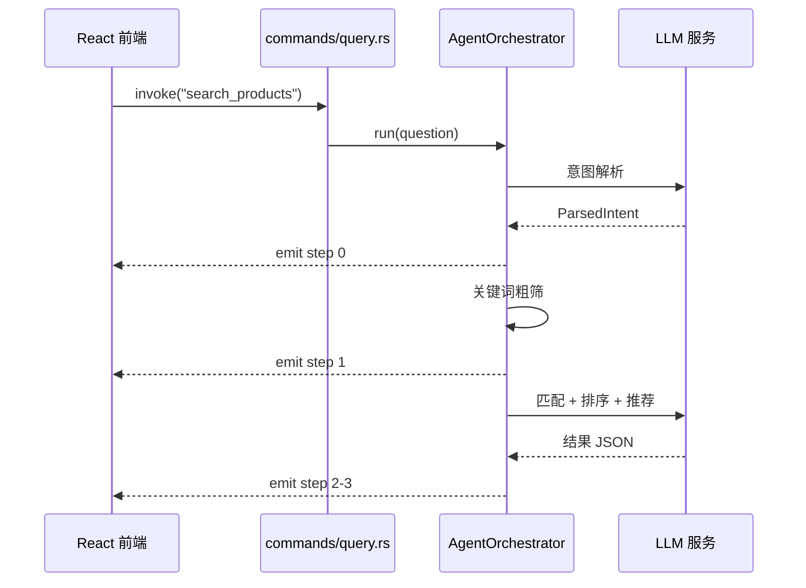

## 分层架构

| 层 | 内容 |
|------|------|
| **前端** | React + TypeScript — ChatInput · ResultCard · PriceComparison · ThinkingBlock · Sidebar |
| **IPC** | Tauri invoke / event |
| **后端** | commands/ (前端入口) → agent/ (Agent 编排) → ai/ (LLM Provider) |

## 模块职责

| 模块 | 路径 | 职责 |
|------|------|------|
| commands | `src-tauri/src/commands/` | Tauri 命令：search_products / get_settings / save_settings |
| agent | `src-tauri/src/agent/` | Agent 编排：意图解析 → 数据筛选 → LLM 匹配推荐 |
| ai | `src-tauri/src/ai/` | LLM Provider 抽象 + OpenAI/Anthropic 实现 |
| models | `src-tauri/src/models/` | 数据结构：Product / ParsedIntent / AgentResult |
| config | `src-tauri/src/config.rs` | 配置加载 |

## 前后端通信

传统 Web 应用用 HTTP + fetch 通信，但 Tauri 桌面应用不走这条路——前后端在同一个进程里，通过 IPC（进程间通信）直接调用。

| 方式 | 方向 | 做什么 | 代码示例 |
|------|------|--------|---------|
| `invoke` | 前端 → 后端 | 触发搜索、读写设置 | `invoke("search_products", { question })` |
| `emit` / `listen` | 后端 → 前端 | Agent 每完成一步，前端进度条前进一步 | `listen("agent-step", callback)` |

**invoke 是什么**：在 JavaScript 里写 `invoke("命令名", 参数)`，Tauri 自动找到对应的 Rust 函数执行，返回值直接回到 JS。全程不走网络、不经过 HTTP 协议——比 fetch 快，也不用处理 CORS。

**emit/listen 是什么**：后端每完成一步就 `emit("agent-step", { index: 0, label: "理解需求" })`，前端用 `listen("agent-step", ...)` 收到后更新进度条。这是实时的、毫秒级的推送。

## AI 接入层设计

不同 AI 厂商的 API 格式不同，但做的事情一样——发消息、收回复。我们用 Rust 的 **trait**（类似 TypeScript 的 interface）抽象这个过程：

```
LlmProvider trait  { chat(messages) → response }
  ├── OpenAiCompatProvider (async-openai)
  └── AnthropicProvider    (reqwest)
```

上层 Agent 编排代码只依赖 `Arc<dyn LlmProvider>`，不关心底层是 DeepSeek 还是 Claude。想换模型？改一行配置，不碰业务代码。

## 数据流



## 运行时配置切换

AgentOrchestrator 包装在 `Arc<RwLock<T>>` 中，保存设置时重建：

1. 用户保存设置 → `save_settings` 命令
2. 写入 `settings.json`
3. 调用 `create_provider()` 创建新 Provider
4. 创建新 `AgentOrchestrator`
5. `RwLock::write()` 替换旧实例
6. 下次查询使用新配置

> **源码**：[`src-tauri/src/commands/settings.rs:47-60`](https://github.com/Badnuker/price-compare-agent/blob/main/src-tauri/src/commands/settings.rs#L47-L60) · [`src-tauri/src/lib.rs:15-23`](https://github.com/Badnuker/price-compare-agent/blob/main/src-tauri/src/lib.rs#L15-L23)
