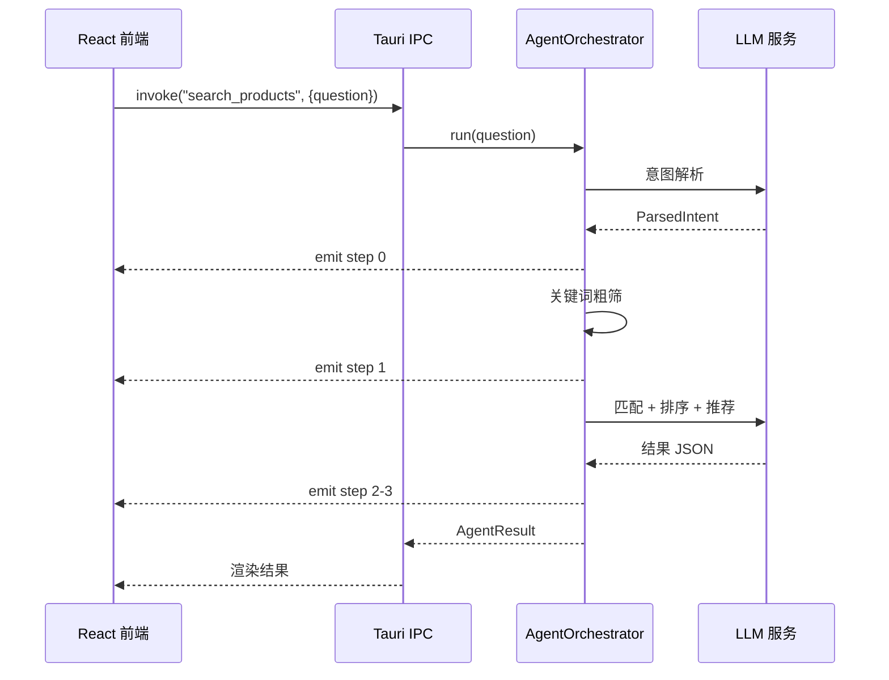

## 分层架构

```
┌─────────────────────────────────┐
│  前端 (React + TypeScript)       │
│  SearchBox / ResultTable         │
│  PriceChart / SettingsDrawer     │
├─────────────────────────────────┤
│  Tauri IPC (invoke / event)      │
├─────────────────────────────────┤
│  后端 (Rust)                     │
│  ┌─────────────────────────────┐│
│  │  commands/  ← 前端调用入口   ││
│  ├─────────────────────────────┤│
│  │  agent/     ← Agent 编排    ││
│  │  orchestrator / intent      ││
│  │  tools (数据加载/粗筛)       ││
│  ├─────────────────────────────┤│
│  │  ai/        ← LLM 调用      ││
│  │  provider / openai_compat   ││
│  │  anthropic                  ││
│  └─────────────────────────────┘│
└─────────────────────────────────┘
```

## 模块职责

| 模块 | 路径 | 职责 |
|------|------|------|
| commands | `src-tauri/src/commands/` | Tauri 命令：search_products / get_settings / save_settings |
| agent | `src-tauri/src/agent/` | Agent 编排：意图解析 → 数据筛选 → LLM 匹配推荐 |
| ai | `src-tauri/src/ai/` | LLM Provider 抽象 + OpenAI/Anthropic 实现 |
| models | `src-tauri/src/models/` | 数据结构：Product / ParsedIntent / AgentResult |
| config | `src-tauri/src/config.rs` | 配置加载 |

## 前后端通信

两种方式：

| 方式 | 方向 | 用途 |
|------|------|------|
| `invoke()` | 前端 → 后端 | 触发搜索、读写设置 |
| `listen()` | 后端 → 前端 | Agent 步骤事件实时推送 |

步骤事件格式：

```json
{ "index": 0, "label": "理解需求" }
```

## 数据流



## 运行时配置切换

AgentOrchestrator 包装在 `Arc<RwLock<T>>` 中，保存设置时重建：

1. 用户保存设置 → `save_settings` 命令
2. 写入 `settings.json`
3. 调用 `create_provider()` 创建新 Provider
4. 创建新 `AgentOrchestrator`
5. `RwLock::write()` 替换旧实例
6. 下次查询使用新配置
